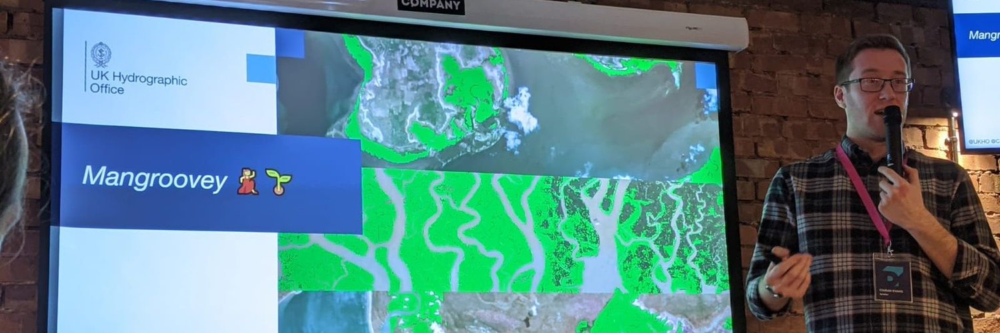

## Who am I?
Hi there! My name's Ciaran (_That's me_ ☝️)

I'm a Cloud Engineer based in the UK 🇬🇧 (I ❤️ the 🇪🇺 and miss them)

## What do I do?
Currently I build serverless awesomeness in AWS [@ DevelopmentSeed](https://developmentseed.org) to help people make the most of their Earth Observation data! 🛰🌍

## What have you done?

Previously I worked [@ UKHO](https://www.admiralty.co.uk/) where I created the [Global Mangrove coverage dataset](https://medium.com/uk-hydrographic-office/creating-a-global-dataset-using-serverless-applications-and-deep-learning-c4e267fa810c?source=friends_link&sk=37ab5a146ad07c93afa63382fa44ad67), scaled deep learning models across the world, processed global shipping traffic, automated tidal analysis, and produced a Hadoop-based geospatial data engine.

# Where to find me:
* ✍️ [Medium](https://medium.com/@ciaranevans)
* 🦜 [Twitter](https://twitter.com/Ciaran_Evans)
* 🧳 [LinkedIn](https://www.linkedin.com/in/ciaranjevans/)
